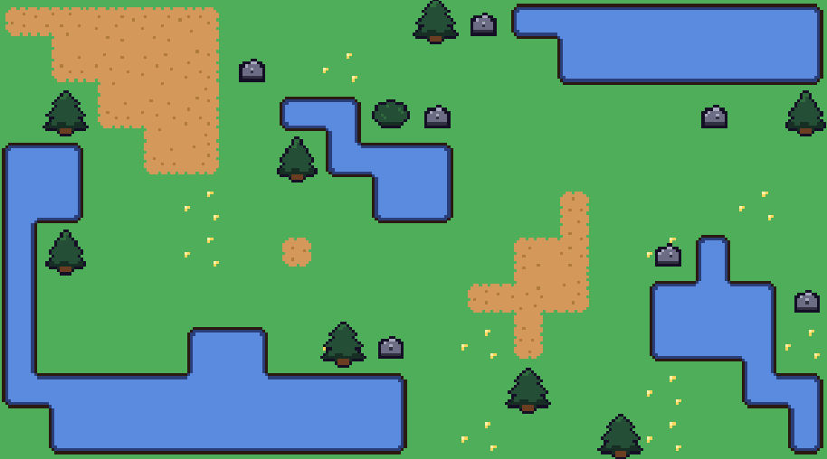
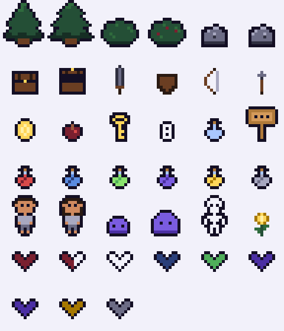
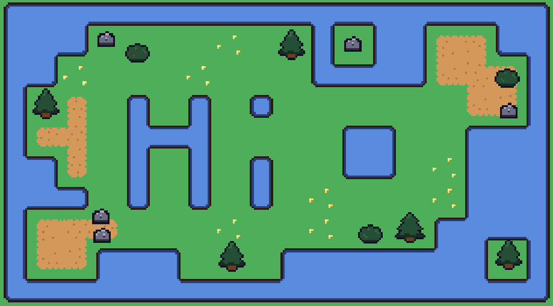

# Gridventure Toolkit

A modular, beginner-friendly toolkit for building top-down adventure games in Unity.

The Gridventure Toolkit is a growing collection of reusable systems, tools, and assets designed to help developers quickly prototype and build polished 2D adventure games.

## Main Goals

The goal of Gridventure Toolkit is to provide:

* Clean, reusable Unity systems
* Beginner-friendly architecture
* Fast prototyping tools
* A cohesive ecosystem of game development modules

Inspired by classic top-down adventure games (like Zelda-style systems), this toolkit focuses on **clarity, modularity, and scalability**.

## Current Systems

### World Generation System (v1.0)

A modular 2D world generation system for Unity that creates procedural tile-based worlds using Perlin noise and ScriptableObject-driven configuration.

GitHub: https://github.com/lizziejperez/gridventure-toolkit-world-generation-system

Features:

* Procedural terrain generation using Perlin noise
* Tilemap-based rendering with Rule Tile support
* ScriptableObject-driven terrain and feature setup
* Deterministic generation using seeds
* Feature placement system (trees, rocks, etc.)
* Save & load system for generated worlds
* Editable worlds via Tile Palette and prefabs
* Includes demo scene with configured generation and controls

### 2D Movement System (v2.0)

A reusable, adventure game–inspired 2D top-down movement system built with Unity’s New Input System, designed for clarity, flexibility, and easy integration.

GitHub: [https://github.com/lizziejperez/gridventure-toolkit-movement-system](https://github.com/lizziejperez/gridventure-toolkit-movement-system)

Features:

* 4-directional movement (up, down, left, right)
* Optional diagonal movement
* Adjustable movement speed
* Supports keyboard and controller input
* Rigidbody2D-based physics
* Includes demo scene + 16x16 pixel assets (player, trees, rocks, bushes)

### Menu & Scene System (v2.0)

A reusable, modular menu and scene management system built with Unity’s New Input System for handling title menus, gameplay transitions, and pause functionality.

GitHub: [https://github.com/lizziejperez/gridventure-toolkit-menu-scene-system](https://github.com/lizziejperez/gridventure-toolkit-menu-scene-system)

Features:

* Title menu system (start game / quit)
* Pause menu system (pause, resume, return to title)
* Centralized scene config (ScriptableObject)
* Intent-based input actions (Confirm / Cancel)
* Ready-to-use prefabs for title and pause systems
* Works for both 2D and 3D Unity projects

### Pixel Assets Free (v4.0)

A cohesive collection of original 16x16 top-down pixel assets designed for rapid prototyping and use with Gridventure Toolkit systems and demos.

Itch.io: https://lizziejperez.itch.io/gridventure-toolkit-16x16-pixel-assets-free

 

Includes:

- Gridventure Toolkit custom color palette
- Environment
  - Grass, water, and path tilesets
- Nature Props (with variants)
  - Trees, bushes, flowers, and rocks
- Items
  - Collectibles
  - Chests
  - Equipment
  - Food
  - Hearts
  - Potions
  - Signs
- Characters
  - Player character variants
  - Slime variants and skeleton
- World & UI Variants
  - World sprites aligned for placement in-game
  - Centered item sprites for inventories, menus, and HUDs
- Flexible Asset Formats
  - Individual sprites organized by category
  - Spritesheets for convenient importing and slicing

## How to Use This Toolkit

Each system is designed to work independently, but together they form a foundation for a full game.

Typical workflow:

1. Import Movement System
2. Add Menu & Scene System
3. Use demo assets or your own art
4. Expand with additional systems (coming soon)

## Roadmap

### Currently Planned

- Sprite Animation System
  - Reusable sprite-based animation system
  - Designed to work with Gridventure Toolkit animated pixel assets
- Health System
  - Reusable player and enemy health
  - Heart-based UI support
- Inventory + Item/Pickup System
  - Reusable item definitions
  - World pickups
  - Inventory management
- Interaction System
  - Reusable interactions for world objects
  - Support for objects such as signs and chests
- Consumable System
  - Food, potions, and other usable items
- Equipment System
  - Equippable weapons and equipment
- Combat + Enemy System
  - Player combat
  - Enemy health and damage
  - Reusable enemy behavior
 
### Future Systems

- Wave Function Collapse (WFC) World Generation
- Dungeon Generation
  - Room-based procedural dungeon generator
  - Designed to work with future dungeon asset packs
- Dialogue System
- Quest System
- Expanded Save / Load functionality

### Asset Packs

- Animated Pixel Assets
- Expanded environment tilesets
- Dungeon tiles + props

## Design Philosophy

* Modular → Use only what you need
* Readable → Clean, well-structured C#
* Expandable → Designed for future systems
* Beginner-friendly → Easy to learn and modify

## 💼 Freelance & Support

Need help integrating or customizing these systems?

I offer freelance Unity and game development services:
[https://www.fiverr.com/lizziejperez](https://www.fiverr.com/lizziejperez)
